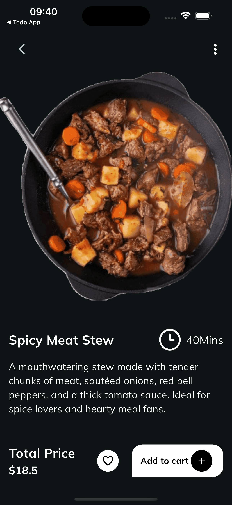

# 🍽️ Ova Food – Flutter Prototype

Ova Food developed at **Ovaar** in less than a week based on a Dribbble design.  
This project demonstrates our ability to turn a static mockup into a smooth, beautiful, and functional app.

---

## 🧠 Why this prototype?

At **Ovaar**, we regularly build complex automation systems, often powered by AI, to help our clients gain efficiency,
reliability, and speed.  
But let’s be honest:

👉 A powerful backend system doesn’t make for a great picture.

So when we stumbled upon an inspiring Dribbble design, we took the opportunity to show off our **frontend skills** too:

> Turn a static mockup into a real Flutter app – fast, fluid, and functional.

---

## 🎨 Design & Image Sources

- 🎨 Original design: https://dribbble.com/shots/6961198-Bubble-Tea-Delivery
- 🖼️ Images used: https://fr.freepik.com/

---

## 📸 Screenshots

<div align="center">
  
  
  
</div>

---

## 🚀 Key Goals

- ✅ Convert a mockup into a working prototype in just a few days
- ✅ Match the design without compromising delivery time
- ✅ Show full **Flutter frontend** mastery alongside our **backend** expertise

---

## 📦 Getting Started

### Prerequisites

- Flutter SDK → https://docs.flutter.dev/get-started/install
- Dart (included with Flutter)
- Android Studio or VS Code
- An emulator or a connected device

### Installation

git clone https://github.com/your-org/food_app.git  
cd food_app  
flutter pub get  
flutter run

---

## 🗂 Project Structure

```
lib/  
├── main.dart           # Entry point  
├── screens/            # Main pages  
├── widgets/            # Reusable UI components  
├── models/             # Data models  
└── services/           # Business logic and data handling
```

---

## 🙌 About

This prototype was built by the **Ovaar** team, specialized in crafting full digital systems – from smart backends to
elegant and responsive user interfaces.

💬 Want the source code or to challenge us with your favorite design? Reach out!

---

## 🔗 Follow us

- 🌐 Website: https://ovaar.net/
- 💼 LinkedIn: https://www.linkedin.com/company/ovaar
- 📧 Email: **contact@ovaar.app**